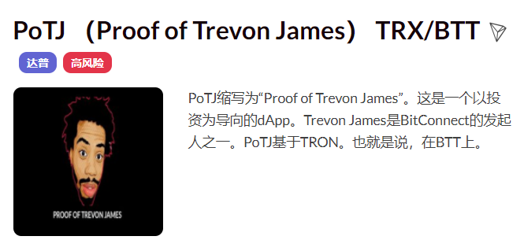

**什么是 PoTJ（Trevon James 的证明）TRX/BTT ？**

“除非是关于无形硬币，否则不要跟我说话！” 回来了！这次是在 TRX/BTT。

PoTJ缩写为“Proof of Trevon James”。这是一个以投资为导向的dApp。Trevon James是BitConnect的发起人之一。PoTJ基于TRON。也就是说，在BTT上。

PoTJ（Proof of Trevon James）TRX /BTT dApp是建立在Tron协议上的高风险类别的加密资产。现在，根据用户数量，它在一般的dApp排名中排名第6879位，在高风险类别中排名第1360位，这使您可以很好地了解PoTJ（Proof of Trevon James）TRX / BTT dApp在其竞争对手中的表现。

通过分析过去30天窗口期内的PoTJ（Trevon James证明）TRX / BTT dApp数据，很明显dApp的余额为36.03美元，交易量稳定在0.00美元。PoTJ（Trevon James的证明）TRX / BTT在30天内生成了0笔交易，变化率为0%。显然，与前7天相比，交易量稳定了0%。过去7天的数据显示，PoTJ（Proof of Trevon James）TRX/BTT用户群为0，稳定了0%。

