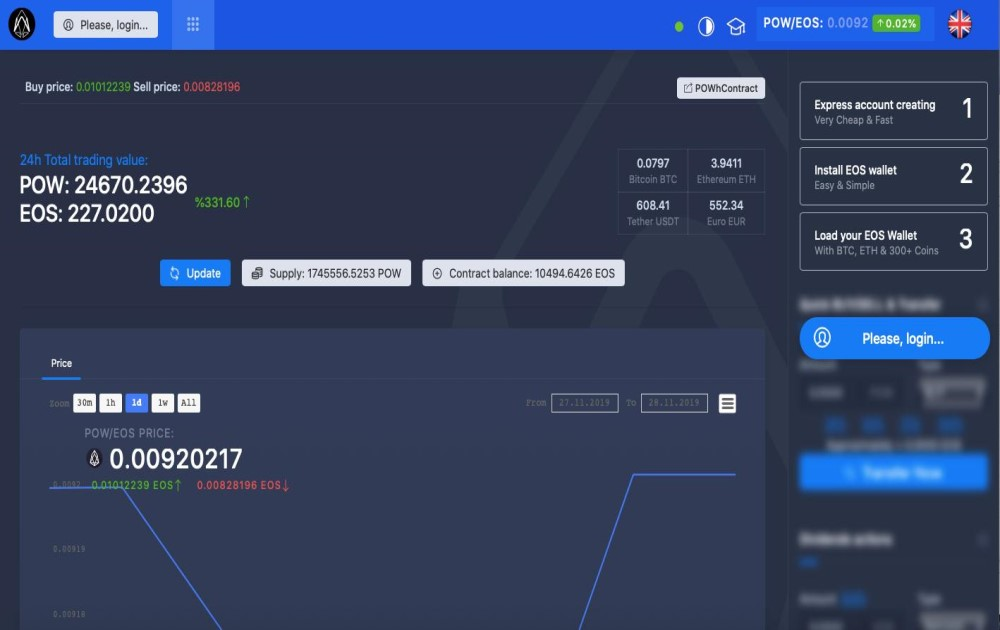

---
title: "POW Ecosystem"
description: "POW是一个基于EOS的交易所，分享利益"
date: 2022-08-23T00:00:00+08:00
lastmod: 2022-08-23T00:00:00+08:00
draft: false
authors: ["june"]
featuredImage: "pow-ecosystem.png"
tags: ["High risk","POW Ecosystem"]
categories: ["nfts"]
nfts: ["High risk"]
blockchain: "EOS"
website: "https://dappradar.com/eos/high-risk/pow-ecosystem"
twitter: "https://twitter.com/powhfund"
discord: ""
telegram: "https://t.me/powhfund"
github: ""
youtube: "https://www.youtube.com/channel/UCWNX_NZxjaMujp5qEuAmBVw"
twitch: ""
facebook: ""
instagram: ""
reddit: ""
medium: "https://medium.com/@powhfund"
steam: ""
gitbook: ""
googleplay: ""
appstore: ""
status: "Live"
weight: 
lightgallery: true
toc: true
pinned: false
recommend: false
recommend1: false
---
**什么是 POW Ecosystem？**

POW 是一个基于 EOS 的交易所，它以透明和可验证的方式将平台上的活动（代币购买、出售或转让）收益分享给所有 POW 代币持有者。价格设定机制在智能合约中定义。Exchange dApp 在完美的经济模拟下运行，每个 POW 代币都授予您所有加密货币数量的股份。

POW基于EOS决定的代币交易所，向POW持币者平台的（代币购买、销售或智能手机），分享方式透明且透明。我们使用合约来定价活动。所有交易所dApp在完美的模拟经济环境下，POW代币都让你获得所有加密货币运行的多种权益。

