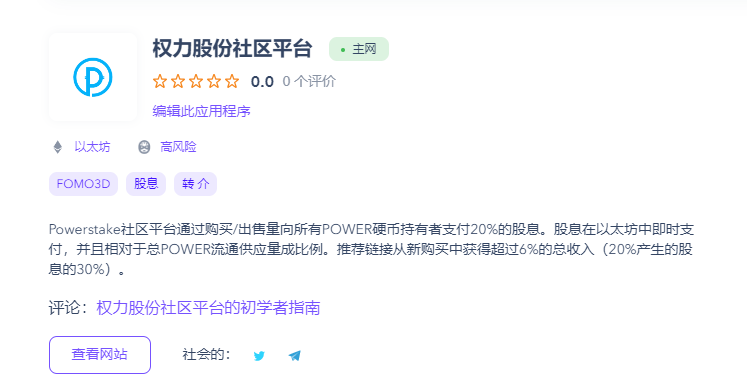

**什么是 Power Stake 社区平台？**

Powerstake 社区平台是一个基于交易量的股息赚取交易所，通过买卖交易量向所有 POWER 代币持有者支付 20% 的股息。股息会立即在以太坊中支付，并且与 POWER 流通的总供应量成比例。推荐链接从新购买中为您赚取超过总额的 6%（20% 产生的红利的 30%）。 

* - 无需在平台上获得推荐！
* - 无需注册、创建帐户、KYC 或 AML。
* - 100% 去中心化！
* - 无交易对手风险！
* - 没有关闭开关！
* - 开源 - 100% 透明！
* - 没有管理员密钥！
* - 没有开发人员费用！
* - 高股息率！
* - 所有参与者的未来每周以太坊现金奖金！
* - 永远无法更改或停止的不可变合约！
* - 只需一枚 POWER 硬币即可拥有有效的推荐链接！
* - Power Stake 社区平台将始终拥有活跃的开发人员和营销团队！

* - 庞大的路线图和未来计划，用于将以太坊引入社区平台的辅助项目和合作伙伴关系！

