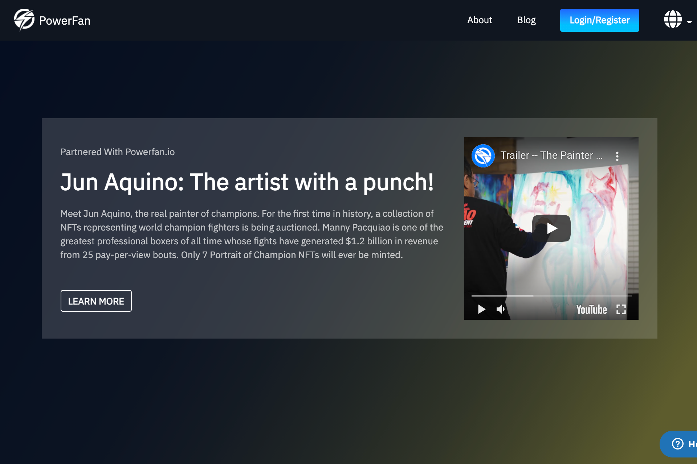

**什么是 PowerFan？**

PowerFan 使作者、内容创建者和粉丝能够以有价值的新方式联系和开展商业活动。

如果您有观众并且您创建内容，那么在区块链上运行的 NFT 是一种创建数字资产的方式，可以让您的粉丝、您的客户、您的客户和您的观众在您的业务和你的品牌。

这可以采取仅对持有特定 NFT 的人可用的独家内容的形式。

它甚至可以允许一对一的咨询或允许参加活动或团体辅导。无论您交付内容，无论您如何与客户互动，现在都可以在 NFT 和区块链上拥有应用程序，从某种意义上说，这实际上是您如何通过利用新技术和取得领先成为所在领域的领导者的演变我们相信 PowerFan 的浪潮最终会在创意、商业，甚至可能是金融和社会方面发生很大变化。

我们甚至会帮助您逐步创建、营销和销售您自己的 NFT 和数字资产。所以今天就加入我们 PowerFan 开始创作，记住创作者和粉丝：你现在拥有力量！

