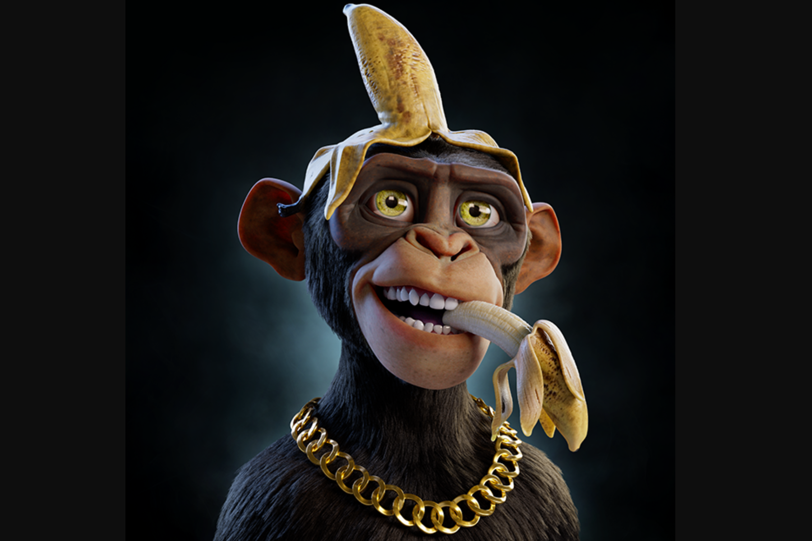

**什么是 Prime Ape Planet PAP ？**

在不到 24 小时的时间里，Prime Ape Planet 的 Discord 会员人数达到了惊人的 100,000 多名。这在 NFT 领域是看不到的。同时，团队非常踏实；我们在这里是长期的，而不是为了快速炒作。这个项目的高价值在于高品质的艺术和准备就绪的虚拟设计的结合。

艺术作品由以狮子王、哥斯拉和漫威、迪斯尼、米高梅等许多其他动画作品而闻名的设计师创作。
知名艺术家 Kurtis Dawe 现在已经决定，他想利用自己的技能和经验，为 NFT 空间带来一个高价值的项目。

为此，他与一个由成功的企业家、名人、经验丰富的艺术家和营销资深人士组成的团队合作，于 2021 年 12 月结束了这个系列。

