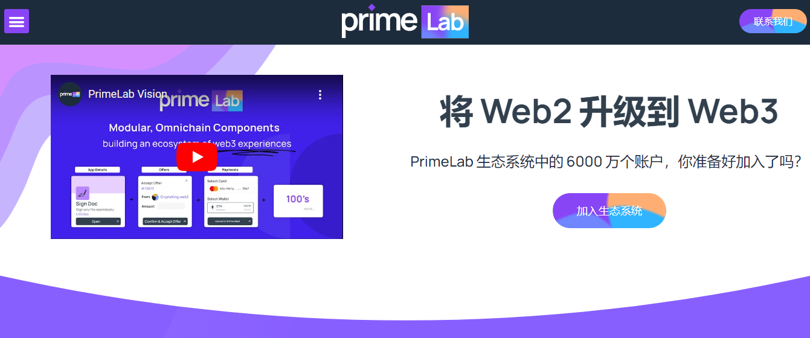

**什么是 Primelab ？**

Near Apps 通过使 web 3 体验更容易接受并为各种企业和用户启用用例来增强 web 3 体验。

**将 Web2 升级到 Web3**

PrimeLab 生态系统中的 6000 万个账户，你准备好加入了吗？

以成本效益取代 SaaS 去中心化金融

企业家可以在启动时克隆任何这些应用程序！

想象一个 Web3 令牌：自动扩展去中心化的云，以实际收益奖励验证者以供消费者使用，验证者不仅仅是鲸鱼……他们是 _ _ _ _ 24/7 全天候工作的现金流。