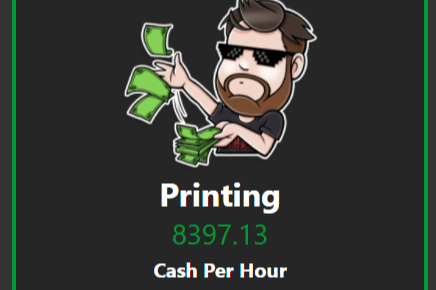

**PrintCash.Online是什么？**

打印现金并将其转换为 BNB！ 要玩，只需购买一个 ACCOUNTANT。

1 ACCOUNTANT 以每天 1 CASH 的速度印钞。

24 ACCOUNTANT 每天打印 24 CASH，或每小时打印 1。

重新投资您的现金以获得更多会计师！反过来，这会提高您的现金打印率或者，您可以将您的 CASH 卖回 BNB 的合约。

当用户买入和卖出时，合约市场会自动膨胀！这样可以保持合同平衡并防止早期购买者永远获利。

