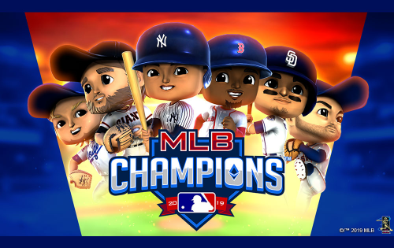
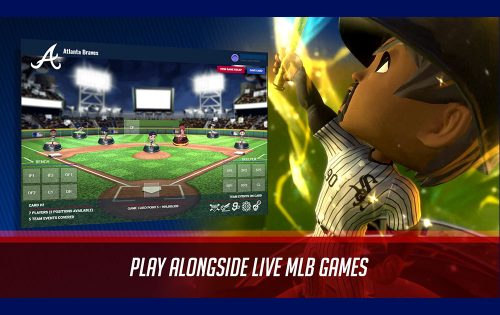

洛杉矶道奇队和 Lucid Sight 自豪地展示了第一个加密摇头公仔！

这些独特的收藏品代表了体育和区块链历史上的一个不朽时刻，是大联盟体育中的第一个加密赠品。

实物 MLB 加密道奇 ETH 卡于 2018 年 9 月 21 日在道奇体育场举行的道奇队与教士队比赛期间分发，其中包含以下人物之一：Clayton Kershaw、Justin Turner 或 Kenley Jansen。

传统的收藏品是有限的、令人垂涎的和有价值的

Crypto Bobbleheads 可能不是物理的，但由于区块链，它们表现出这些相同的品质

区块链保证了真正的数字所有权：每个 Crypto Bobblehead 都可证明是独一无二的，并且是仅存在的 40,000个集合的一部分，并且永远不会再被铸造

作为加密代币，这些卡可能具有类似于收藏品或艺术品的价值，可以拍卖、与他人共享或保存。

