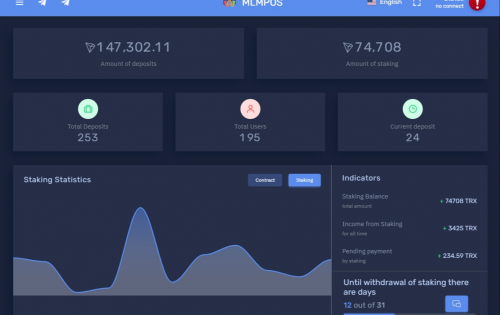
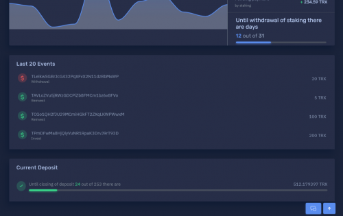
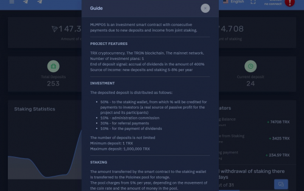

MLMPOS是一种投资智能合约，收入来自全球团队质押。

为项目及其参与者提供真正的被动利润来源。

**投资**

押金分配如下：

50% - 到项目质押池

30% - 用于推荐付款

10% - 用于支付池

10% - 行政佣金

分钟。存款：1 TRX

最大限度。存款：1,000,000 TRX

**推荐计划**

10个推荐级别。

奖励大小：10,5,3,2,2,2,2,2,1,1 %

获得推荐的每笔存款（自动再投资）的推荐奖励。

**股息**

每次存款（自动再投资）都会产生 400% 的股息。

300% 支付给投资者

100% 自动再投资

**自动再投资**

每笔存款可能的自动再投资次数为 10

这意味着，1 次存款工作 1 + 10 圈每 300% 总共 11 圈每一次存款

**支付**

即时通过向智能合约发送提款命令。

**佣金**

对于任何存款 100 TRX

对于任何退出 3 TRX

