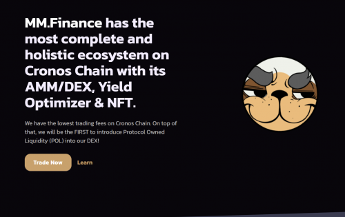
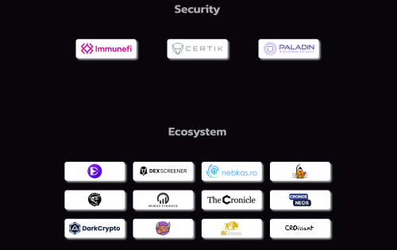

MM.Finance 是 Cronos 链上的第一个 AMM 和 DEX，通过贸易挖矿提供费用回扣。我们在 Cronos Chain 上拥有最低的交易费用。最重要的是，我们将率先将协议拥有的流动性 (POL) 引入他们的 DEX！

MM.Finance 拥有 Cronos 上最大的生态系统，其 DEX、收益优化器、NFT、Algo 稳定币和 DTF。
他们在 Cronos Chain 上的交易费用最低，为 0.17%。最重要的是，他们是第一个在 Cronos 上将协议拥有的流动性 (POL) 引入他们的生态系统的人。

