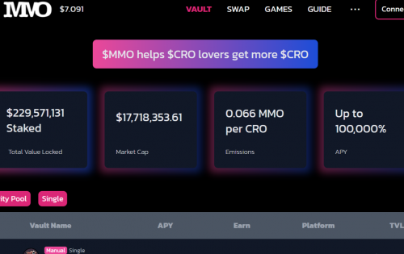
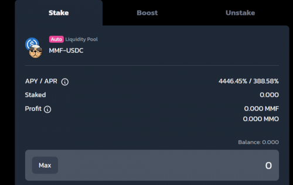

MM Optimizer 旨在为用户提供最简单的方式来加入 DeFi 世界的潮流，建立在 MM Finance 之上，为您提供最美味的 MMF 以及 MMO。我们支持底层的 DeFi 技术和生态系统，通过 Cronos 链（CC）来复合用户收益。自从 Yield Aggregator 项目在具有 MakerDAO、Aave、Compound 等现有协议的不同区块链网络上兴起以来，我们看到 DeFi 活动在 2020 年出现了大幅增长。作为在收益农业经济中发挥重要作用的 Yield Aggregator，我们正在利用不同的 DeFi 协议和策略来最大化用户利润。

在 Cronos 上进行 Yield Farming 的最佳理由是较低的 gas 费用，这为个人进入迷人的 DeFi 空间创造了较低的进入门槛，并能够以很少的资金收获作物并获得丰厚的回报。通过智能合约，MM Optimizer 可以让个人轻松获得复利的成果，因为他们会计算最佳复利频率并自动复利用户的代币。

MM Optimizer 使用 MM Finance 进行单产农业——我们的生态系统产品之一，也是目前该领域的顶级 AMM/DEX 之一。因为它们是周围领先的创新平台之一。MM Optimizer 致力于策划新的和更好的产量优化策略。他们将首先为 MM Finance 优化收益农场，并且可能会扩展到优化其他 Dex 上的其他农场。

他们也在 MM Optimizer 上拥有自动复合保险库，利润会自动复合到相应的池中，从而提高用户的投资回报率。

