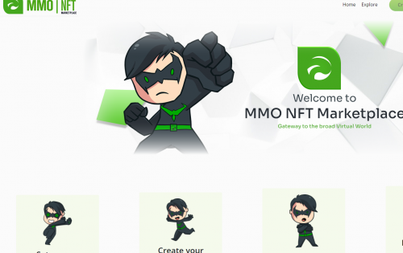
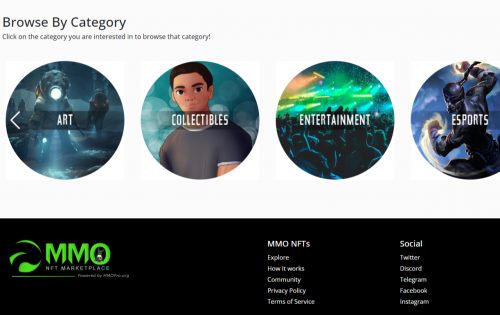
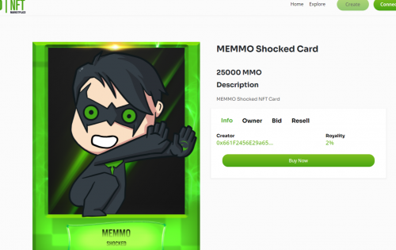

---
title: "MMO NFT Marketplace"
description: "MMO NFT 市场旨在成为在 BNB 链上购买、出售或交易数字艺术和收藏品的最简单、最便捷的方式。"
date: 2022-08-22T00:00:00+08:00
lastmod: 2022-08-22T00:00:00+08:00
draft: false
authors: ["seven"]
featuredImage: "mmo-nft-marketplace.png"
tags: ["Marketplaces","MMO NFT Marketplace"]
categories: ["nfts"]
nfts: ["Marketplaces"]
blockchain: "BSC"
website: "https://mmonft.gallery/"
twitter: "https://twitter.com/MMOProOfficial"
discord: "https://discord.com/invite/MVh5AR8"
telegram: "https://t.me/mmoprocoin"
github: ""
youtube: "https://www.youtube.com/c/MMOPro"
twitch: ""
facebook: "https://www.facebook.com/login/?next=https%3A%2F%2Fwww.facebook.com%2FMMOProDotOrg"
instagram: ""
reddit: ""
medium: ""
steam: ""
gitbook: ""
googleplay: ""
appstore: ""
status: "Live"
weight: 
lightgallery: true
toc: true
pinned: false
recommend: false
recommend1: false
---
MMOCoin Pro 在 BNB 链上为 NFT 建立了一个去中心化的市场。

MMO NFT 市场旨在成为在 BNB 链上购买、出售或交易数字艺术和收藏品的最简单、最便捷的方式。

NFT 是在区块链上创建的虚拟物品——通常用于证明数字资产的独特所有权，可以是从艺术、音乐、游戏到体育交易卡的任何东西。创建者或存款人将获得所有后续交易的 1% 至 10% 的特许权使用费。

数字艺术支撑体系是建立在创作者、策展人和收藏家之间相互尊重的基础上的。MMO NFT Marketplaces 是一个文化社区，希望每个人都同意基本的关键规则和期望。我们希望您能体现我们的所有理想，并帮助建立一个热情的社区，为创作者和收藏家提供支持。

MMO NFT 市场极其重视创作者和创作者的观点。他们认真对待这一点，因为建立信任对于维持健康的社区至关重要。当您在 MMO NFT Marketplace 上铸造和出售 NFT 时：创作者可以保留所有合法权利，包括其原创作品的商标和版权。创作者拥有复制、分发和展示您的艺术作品以及制作衍生作品的所有权利。作为创作者您不能做的事情：创作者不能上传其他任何人的版权或专有作品。创作者无法创建可以代表同一艺术作品的其他 NFT。他们确实接受完全接受的系列中的相关作品。

