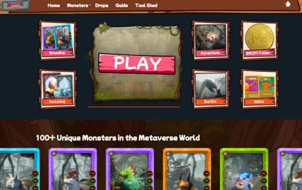
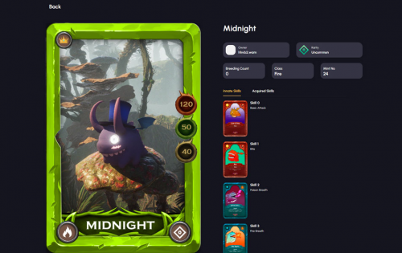
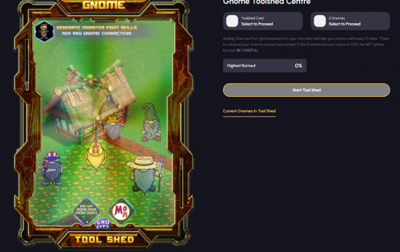

Monster Fight允许用户繁殖他们的怪物。在与其他玩家或 AI 的战斗中与你的怪物战斗。您可以升级，赚取 $MOFI 并通过繁殖来建立您的怪物。 

在 PvP 和冒险模式中玩你可以赢得 MOFI。您需要 3 个怪物才能开始 PvP 或冒险模式。

您的怪物具有默认技能，但您可以在进入比赛时随时使用其他技能。

Monster Fight有超过100个怪物准备好了。培育你的怪物可以为你赢得一个不同的怪物。明智地选择你繁殖的地方。

您可以在 MOFI 市场上列出您的 Monster Fight NFT 以获得更多 MOFI。社区可以买卖 Monster Fight NFT。

Monster Fight是一款赚取NFT游戏的游戏。你可以和其他人或电脑一起玩。在玩游戏时赚取 MOFI。开始升级你的怪物！

