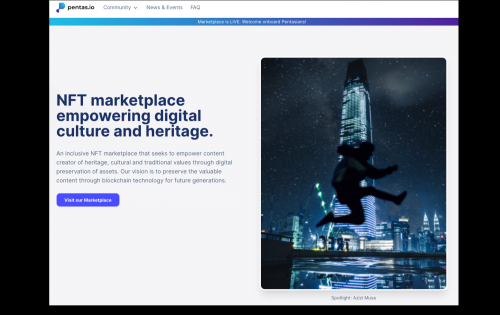
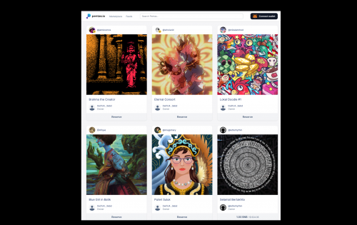

---
title: "Pentas"
description: "NFT 市场赋能数字文化和遗产。"
date: 2022-08-23T00:00:00+08:00
lastmod: 2022-08-23T00:00:00+08:00
draft: false
authors: ["seven"]
featuredImage: "pentas.png"
tags: ["Marketplaces","Pentas"]
categories: ["nfts"]
nfts: ["Marketplaces"]
blockchain: "BSC"
website: "https://www.pentas.io/"
twitter: "https://twitter.com/pentas_io"
discord: "https://discord.com/invite/rvBA2u4r5E"
telegram: "https://t.me/PentasIO"
github: ""
youtube: "https://www.youtube.com/channel/UCapH6WI2CX0pQCM8-_4uIFA"
twitch: ""
facebook: "https://www.facebook.com/pentasio"
instagram: ""
reddit: ""
medium: ""
steam: ""
gitbook: ""
googleplay: ""
appstore: ""
status: "Live"
weight: 
lightgallery: true
toc: true
pinned: false
recommend: false
recommend1: false
---
PENTAS 是一个马来语单词，意思是“舞台”——一个展示和欣赏人才的地方。在 PENTAS，我们特别鼓励展示突出社会文化和遗产方面的数字艺术品，以确保这些遗产能够随着时间和技术而得到保存、发展和繁荣。

PENTAS 由一群志同道合的人创立，他们相信在不断增长的去中心化应用生态系统 (dApps) 领域利用区块链技术的优势和潜力。

成为 PENTAS 的一员，与我们一起参与这场不断改变数字世界格局并连接过去、现在和未来的技术演进！

Pentas 由一群志同道合的人创立，他们渴望倡导和教育大众区块链技术。

公众宣传一直是 Pentas 团队的根本动力。Pentas 了解在新技术方面对社区进行教育的重要性。

Pentas 渴望成为社区推动者，成为引领这一技术启示和革命的主要催化剂。

Pentas 专注于通过数字艺术弥合和突出文化和遗产。区块链技术使这成为现实。

这使得遗产的连续性让下一代能够欣赏生活的基本面，以及如何保存和承认它。

因此，Pentas 提出了 NFT Marketplace 平台，作为所有创作者和艺术家表达才华的推动者，通过他们的手艺传播他们内心的想法和信息。

此外，它可以通过区块链技术进行存储和保护。动力不止于此，而这仅仅是伟大开端的开始。

