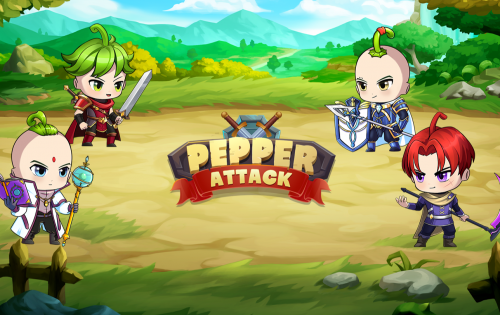
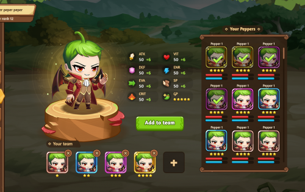
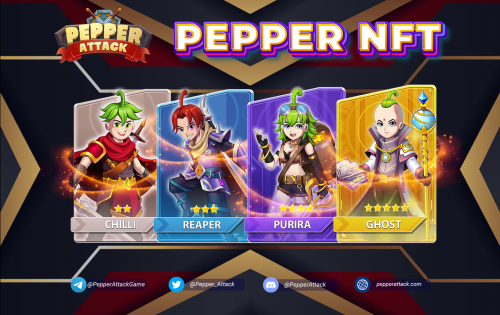

Pepper Attack 是一款付费玩的回合制策略游戏。玩家可以通过收集、战斗、挖矿来获得MYTE代币。MYTE 用于购买 Pepper Attack 虚拟世界中的游戏角色、物品和土地。

每个人心中都有一个对龙和仙子仍然兴奋的孩子——一个准备离开平凡踏上新旅程的冒险家。Pepperland是为这个人创造的，拥有神秘的生物、闪亮的宝藏和惊心动魄的故事。让你的想象力再次疯狂！

区块链技术允许以许多创造性的方式创造财富，其中一种应用就是游戏。在 Pepper Attack 经济的核心，您的行为将为您自己和整个生态系统创造价值。在沉浸在众多有趣活动中的同时，您还将学习新技能，打造传奇物品，并成为可持续经济的关键参与者。

社区是 Pepper Attack 的核心。有定期的活动、游戏和竞赛，供社区成员参与并相互了解。邀请您分享您的想法、构建游戏、结交朋友并一起做伟大的事情。

