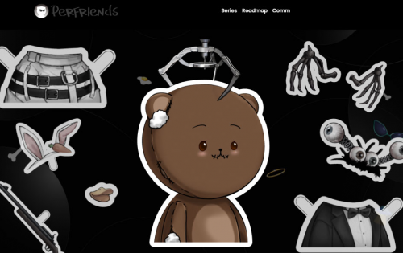
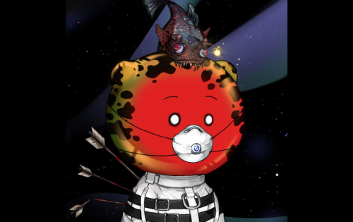
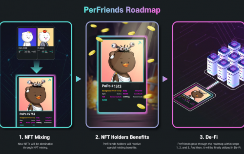

欢迎来到 Per Friends NFT 的世界！
我们的 Per Friends 可以用 NFT 做什么？数字艺术体验？游戏？去中心化金融？元界？
立即加入 Per Friends 令人兴奋的 NFT 世界！

PerFriends 是一个系列。第一张 Popo 发行，众多 Popo NFT 卡被抢购一空。Popo 有多种款式和等级可供选择。按等级奖励的镐可用于在 PER 生态系统中实施的 DeFi 中进行挖矿。目前，我们正在通过各种活动和混合系统，为持有者和新用户的持续兴趣和参与而努力。此外，由于 PerFriends 是一个系列，因此除了 PoPo 之外，还计划发布各种其他 NFT 项目。

