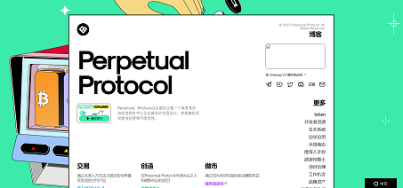

Perpetual Protocol 是一个去中心化的永续期货交易所，在去中心化金融的前沿运作。该协议忠实于 DeFi 的精神，强调社区、去中心化和可组合性。

该协议旨在通过让用户访问其最受欢迎的金融工具：永续期货合约来实现金融民主化。它赋予用户前所未有的自由和灵活性，让他们在加密市场中表达自己，并能够利用杠杆做多或做空。

Perpetual Protocol 还为开发人员提供了高度可组合和高度流动的协议，为开发人员提供了一个全新的设计空间，可以在挖掘 Web3 令人兴奋的潜力的同时进行创作。

Perptual Protocol永续协议是一个具有良好流动性的去中心化永续合约交易协议，有极高的开发者友好度和可组合性。

