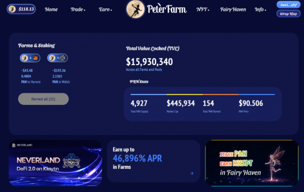

PeterFarm 是 Klaytn Network 上的一个单产农业项目。

它有几个不同于普通单产农业项目的特点。

 原生代币：$PAN

 NFT Staking：Neverland Hodling 级别 NFT 可用于种植 $PAN

 NFT Boosting：Neverland Pirate Ship NFT 可用于提升 APR

 Fairy Haven：稳定的代币 (KUSDT) 奖励池与 $PAN 质押

PeterFarm 是 Neverland Finance 的兄弟项目，已在 DappRadar 上架

