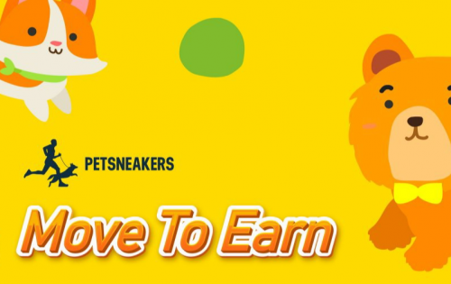

当您加入 PetSneakers “宇宙”，您不仅有机会每天锻炼身体，还可以参与训练您的宠物。PetSneakers 的区块链系统将记录您的训练结果，并将其转换为 PSC 代币。使用这些代币，您可以购买或质押以获得更多利润。此外，用户还可以用它来购买更多的 NFT 运动鞋。您练习得越多，获得的代币就越多，这也激励您获得健康益处、有价值的奖励并与您的宠物互动。

大多数宠物主人都清楚与伴侣动物分享生活带来的直接乐趣。然而，我们中的许多人仍然没有意识到依偎在毛茸茸的朋友身边的乐趣也会带来身心健康的好处。直到最近，研究才开始科学地探索人与动物结合的好处。

宠物已经进化到能够敏锐地适应人类以及我们的行为和情绪。例如，狗能够理解我们使用的许多单词，但它们更擅长解释我们的语气、肢体语言和手势。和任何好朋友一样，一只忠诚的狗会看着你的眼睛来衡量你的情绪状态，并试图了解你的想法和感受（当然，还会计算出下一次散步或款待的时间）。

宠物可以减轻压力、焦虑和抑郁，缓解孤独感，鼓励锻炼和玩耍，甚至可以改善心血管健康。照顾动物可以帮助孩子们在成长过程中更加安全和活跃。宠物也为老年人提供宝贵的陪伴。

根据世界卫生组织 2020 年体力活动和久坐行为指南，成年人应进行 150-300 分钟的中等强度或 75-150 分钟的高强度体力活动，或中等强度和高强度的等效组合每周有氧运动。在儿童和青少年中，一周内平均每天 60 分钟的中等至剧烈强度的有氧运动对健康有益。

事实上，大多数人的体育活动频率都达不到平均水平。超过 25% 的成年人和近 80% 的青少年不锻炼。这导致 39% 的 18 岁及以上成年人超重，13% 肥胖。并且它在未来几年呈增长趋势。这就是运动器材增长强劲的原因。

认识到上述情况，结合当今区块链技术的强势崛起，我们带来了一个突破性的解决方案，让世界移动，称为“PetSneakers”。它可以帮助人们与宠物一起跑步以赚取 PSC 代币。

