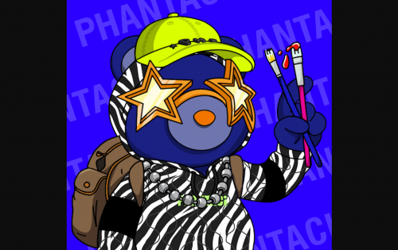
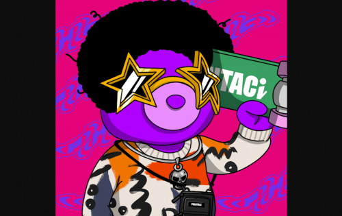

---
title: "PhantaBear"
description: "Phanta Bear 是 10,000 个通过算法生成的数字收藏品的集合，它们兼作 Ezek 俱乐部的会员卡。"
date: 2022-08-23T00:00:00+08:00
lastmod: 2022-08-23T00:00:00+08:00
draft: false
authors: ["seven"]
featuredImage: "phantabear.png"
tags: ["Collectibles","PhantaBear"]
categories: ["nfts"]
nfts: ["Collectibles"]
blockchain: "ETH"
website: "https://ezek.io/"
twitter: "https://twitter.com/EzekClub"
discord: "https://discord.com/invite/ezekclub"
telegram: ""
github: ""
youtube: ""
twitch: ""
facebook: ""
instagram: ""
reddit: ""
medium: ""
steam: ""
gitbook: ""
googleplay: ""
appstore: ""
status: "Live"
weight: 
lightgallery: true
toc: true
pinned: false
recommend: false
recommend1: false
---
2013 年，在拍摄 Jay 编写、导演和表演的《屋顶》时，我们不禁想知道是否有某种方式可以让观众超越单纯的看电影，让他们真正完全沉浸其中在体验中。

PHANTACi是拥有无穷创意灵感的Jay和对时尚行业有独到见解的Ric于2006年创立的时尚品牌。PHANTACi 融合了来自 Phantom 一词所传达的肮脏和 Fantasy 概念可能达到的伟大壮丽的设计和想法。

现在我们想通过创建 Phanta Bear NFT 项目将我们的艺术愿景与新的区块链时代结合起来。幻影熊有两只明亮的星光眼睛，心中充满了华语天王的艺术天赋。10,000 只独特的幻影熊以 PHANTACi 的标志性时尚为特色，并提供丰富的线上和线下福利，让它们的主人在虚拟世界内外都能享受生活。

Matrix Labs 团队是一群经验丰富的区块链开发人员。他们正在与 Ezek 合作，将 Phanta Bear NFT 系列在区块链上变为现实。

Matrix Labs 也是令人兴奋的下一代虚拟世界项目 Matrix World 背后的创造者。在 Matrix World 中，用户将能够以前所未有的方式创建、连接、探索和玩耍；他们甚至可以通过出售他们的作品来赚钱！

