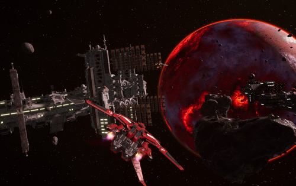
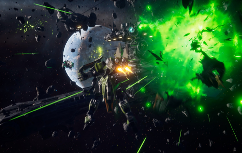
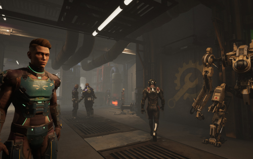

---
title: "Phantom Galaxies Origin"
description: "PHANTOM GALAXIES 将开放世界的太空模拟游戏与快节奏的机械射击游戏和引人入胜的故事相结合。"
date: 2022-08-23T00:00:00+08:00
lastmod: 2022-08-23T00:00:00+08:00
draft: false
authors: ["seven"]
featuredImage: "phantom-galaxies-origin.png"
tags: ["Collectibles","Phantom Galaxies Origin"]
categories: ["nfts"]
nfts: ["Collectibles"]
blockchain: "Polygon"
website: "https://phantomgalaxies.com/"
twitter: "https://twitter.com/the_phantom_g"
discord: "https://discord.com/invite/PhantomGalaxies"
telegram: "https://t.me/PhantomGalaxies"
github: ""
youtube: ""
twitch: ""
facebook: "https://www.facebook.com/login/?next=https%3A%2F%2Fwww.facebook.com%2FPhantomGalaxies"
instagram: ""
reddit: ""
medium: "https://medium.com/@PhantomGalaxies"
steam: ""
gitbook: ""
googleplay: ""
appstore: ""
status: "Live"
weight: 
lightgallery: true
toc: true
pinned: false
recommend: false
recommend1: false
---
Phantom Galaxies是一种快节奏的第三人称体验，其外观和玩法与数百万玩家已经熟悉的传统 3D 动作角色扮演游戏 (ARPG) 一样，但重要的区别在于它将允许玩家行使治理权并拥有真正的所有权和通过使用可替代和不可替代的代币（NFT）来控制他们的游戏内资产（例如机甲、设备、头像和游戏货币）。 

幻影星系旨在成为领先的多链科幻机甲共享世界在线 ARPG。它将提供最完整的 PC 和主机游戏体验，集成区块链，以实现真正的游戏资产所有权和玩家驱动的治理。 

Phantom Galaxies 将是一款完整的“AAA”游戏，将成为玩家和代币持有者真正游戏内治理的光辉典范。通过通过多链框架支持多个加密社区，Phantom Galaxies 将在单个元宇宙中迎合数百万玩家和各种项目合作。 

Phantom Galaxies 的游戏世界将与多种媒体渠道相结合，提供完整的跨媒体叙事体验。玩家将通过游戏玩法、书籍、漫画、动漫和 NFT 收藏品来探索 Phantom Galaxies 的故事。

