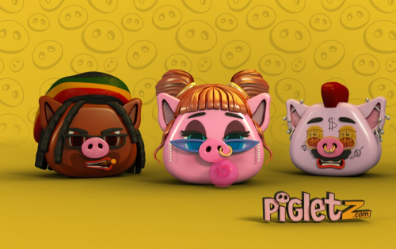

Pigletz 是一款带有 DeFi 元素的收藏游戏。它是围绕主角——Piglet 构建的，Piglet 是一种 NFT，具有作为存钱罐的实用程序，用户可以在其中存入加密代币并赚取 PiFi。Pigletz 是物品。现代版本的存钱罐。可以存在于 MetaVerse 中的项目。并且也可以存在于现实世界中。但两者都不是。每只小猪的生命开始时都是随机铸造的，并且处于 1 级。处于 1 级意味着只有一些零食被展示出来。小猪的主人为了随着关卡的进步，展现更多的特质，需要等待并收集PiFi（类似于经验值）。有一些选项可以加快收集速度——例如，通过完成任务和激活助推器。每个 Piglet 都有自己的钱包——一个由 Piglet 自己拥有的智能合约。打破是小猪生命中的最后一步。通过破坏它，所有者实际上是在杀死它，失去其 NFT/收藏价值，但获得其中的所有资产。它的独特功能之一是实现 Piglet 的选项。为了做到这一点，所有者将小猪押在特定的合同中，并获得一个真正的 3D 打印 Pigletz 模型。在物化过程中，NFT 被锁定，无法转移。解锁它的唯一方法是打破 Pigletz 人物（在现实世界中）并使用其中的代码解锁它。最后，游戏就是两难境地——这是更有价值的——作为 NFT 的 Piglet 或其中的代币。它的独特功能之一是实现 Piglet 的选项。为了做到这一点，所有者将小猪押在特定的合同中，并获得一个真正的 3D 打印 Pigletz 模型。在物化过程中，NFT 被锁定，无法转移。解锁它的唯一方法是打破 Pigletz 人物（在现实世界中）并使用其中的代码解锁它。最后，游戏就是两难境地——这是更有价值的——作为 NFT 的 Piglet 或其中的代币。它的独特功能之一是实现 Piglet 的选项。为了做到这一点，所有者将小猪押在特定的合同中，并获得一个真正的 3D 打印 Pigletz 模型。在物化过程中，NFT 被锁定，无法转移。解锁它的唯一方法是打破 Pigletz 人物（在现实世界中）并使用其中的代码解锁它。最后，游戏就是两难境地——这是更有价值的——作为 NFT 的 Piglet 或其中的代币。

