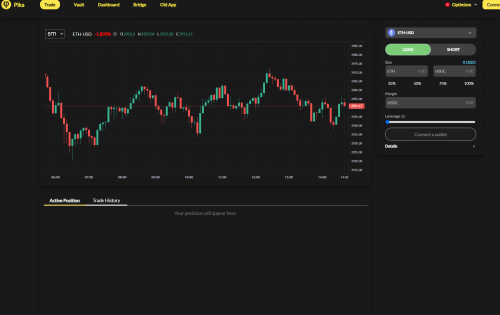

Pika 协议是以太坊第 2 层上的去中心化永久互换交易所，具有：

高杠杆：支持高达50倍的杠杆。

深度流动性：达到与顶级永续交易所同等水平的流动性。

交易任何资产：从加密开始并扩展到非加密。

低费用：建立在以太坊第 2 层上，gas 费用低。

简单体验：直接从您的钱包中兑换，无需进行任何存款。

Pika 的流动性集中在当前的预言机价格附近，可以达到与顶级永续交易所相同的流动性水平。这可以在不需要太多交易所流动性的情况下实现资本效率和最小的交易滑点。

Pika 使用 Chainlink 预言机的混合价格馈送和来自顶级交易所的快速预言机来决定标记价格。每当提交订单时，快速预言机将从 Binance、FTX 和 Coinbase 获取中间价，并在执行订单前更新标记价格。这可以防止预言机抢占先机，因为标记价格仅在订单提交后确定。为了保障快速预言机的准确性，当快速预言机没有更新或价格与 Chainlink 偏离太多（2%）时，Chainlink 预言机与买卖差价一起使用。此外，交易者可以为每笔订单设置允许的滑点，以确保仅当标记价格在允许的滑点范围内时订单才会被执行。

