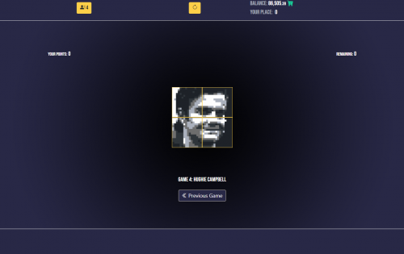
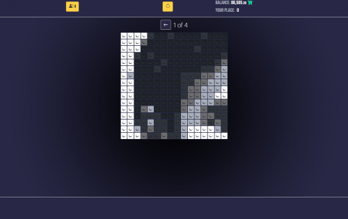
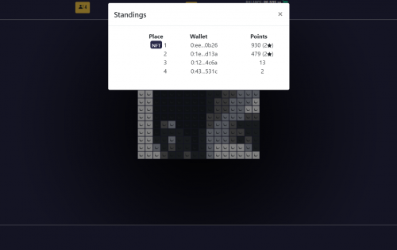

PileBlocks 是一款区块链多人 GameFi 应用程序，允许玩家一起完成图块中的图像并赚取代币。

比赛分为几轮。一轮的目标是用正确颜色的图块完成先前选择的图像。社区使用我们的 32x64 5 色编辑器创建图像，并为他们接下来要完成的图像投票。回合结束后，获胜者将获得奖品。

一旦您购买了 1 个 PILE 代币 (TIP3.1)，您就会自动开始耕种瓷砖。你买的越多，你得到的越多，但最大是1024块，你不能超过这个。此外，还有一些公式的细微差别可以防止鲸鱼比普通用户捕获更多的瓷砖。

在耕种过程中，您只知道瓷砖的数量，而不知道它们的颜色。进入游戏回合后，您将获得实际的彩色瓷砖。这些颜色几乎均匀分布，因此，在声明时，您会得到相同数量的白色、浅灰色、深灰色和黑色瓷砖，但波动是可能的。

您可以放置多达 50 个已声明的图块来完成图像。

玩家可以通过将声称的图块转换为他们用来完成图像的*彩色*图块来参与一轮。这些彩色瓷砖只能在它们被铸造的确切游戏中使用。由于每一轮都需要不同的颜色来完成图像，因此该应用程序会在 5 种颜色之间平均分配 80% 的图块。其余 20% 随机分配，以确保运气因素并为不同策略提供更多潜力。例如，一个玩家已经种植了 1000 个瓷砖并想要转换它们。他们收到 160 个白色、160 个浅灰色、160 个半灰色、160 个深灰色和 160 个黑色瓷砖 (160 x 5 = 800)。其余 200 个将随机分布在不同颜色之间。

