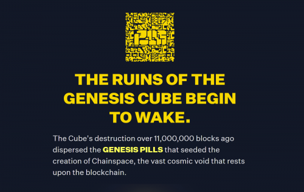
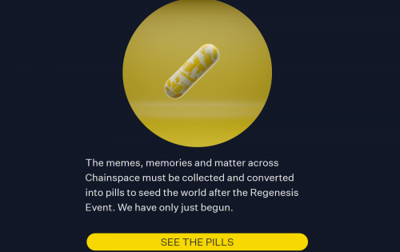
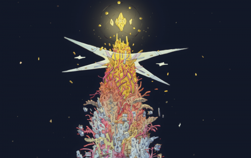

PILLS 将以太坊转变为一个链上角色扮演游戏，设置在一个名为 Chainspace 的虚构宇宙中。
一个存在于链上的可互操作和可组合的游戏世界，融合了交互式游戏玩法和社区故事讲述。在PILLS中，玩家创造和塑造游戏世界。

PILLS世界由SYNTH提供支持， SYNTH是一种 Solidity 游戏引擎，可实现可组合性和互操作性。任何人都可以创建相互关联的游戏和叙事体验，从而影响和发展您的可玩PILLS头像和整个 Chainspace 宇宙。

PILLS 是一种新型的混合游戏。一个存在于链上的可互操作和可组合的沙盒世界，将交互式游戏玩法和社区故事讲述与任何人都可以构建和扩展的 RPG 进程相结合。有两种玩游戏的方式：作为创作者，开发叙事媒体或与我们的 Solidity 游戏引擎 SYNTH 互操作的互动体验。或者作为一个居住和探索社区创造的体验星座的玩家。核心团队 CAPSULE 目前正在制作一个将于第 2 季发布的 3D 制作迷你宇宙。

