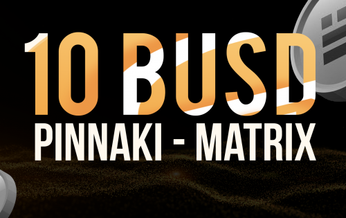

Pinaki：去中心化矩阵平台。

PINAKI 是一个由智能合约保护的去中心化网络平台，提供多种投资机会。没有人作为中央机构来管理或控制这个平台。一旦建立了创收结构，现在它正在开发其世界级的自动交易机器人。PINAKI 提供加密交易机器人和外汇交易机器人。这基本上是基于安全可靠的币安智能链 (BSC) 开发的。

基本上，PINAKI 提供分为三种结构的 60Busd 投资计划。10busd - Pinnaki 矩阵，20BUSD - 推荐收入和 30BUSD - 匹配点收入。该平台还提供从属计划的好处。您可以分享、推荐和赚取。PINAKI 还提供加密交易和外汇交易的教育平台。

营销中使用的 BUSD 是币安智能链区块链上的 BEP-20 格式代币。

对于发送 BUSD 或 BSC 网络上的任何其他代币，您必须为交易支付一定数量的 BNB。因此，需要有 BUSD 参与营销和足够的 BNB 支付网络费用。

你的资本在你的掌控之中

所有用户资金都锁定在智能合约中

没有任何第三方可以直接使用这些资金。Pinaki 是非托管的，从不控制任何资产。它可以直接从您控制的钱包中使用。

已验证的智能合约

低交易费用

独特的推荐计划

Pinaki 矩阵程序

