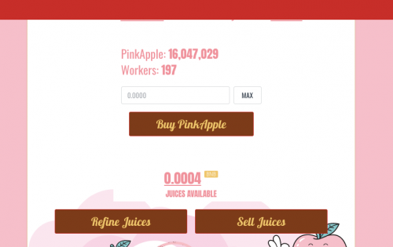
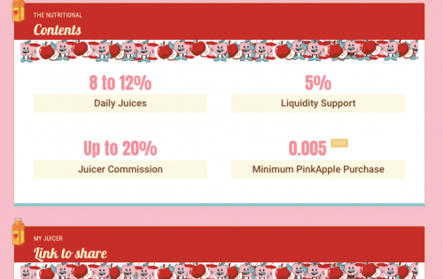

---
title: "PinkApple"
description: "加入 BSC 上最好的单产农场采矿项目。每天赚取 8% 至 12% 的可观回报，甚至通过 20% 的推荐人奖金赚取更多。"
date: 2022-08-23T00:00:00+08:00
lastmod: 2022-08-23T00:00:00+08:00
draft: false
authors: ["seven"]
featuredImage: "pinkapple.png"
tags: ["High risk","PinkApple"]
categories: ["nfts"]
nfts: ["High risk"]
blockchain: "BSC"
website: "https://pinkapple.app/"
twitter: "https://twitter.com/PinkAppleApp"
discord: ""
telegram: "https://t.me/PinkAppleApp"
github: ""
youtube: "https://www.youtube.com/channel/UC33Iui00qspSBpseqSKDfyg"
twitch: ""
facebook: ""
instagram: ""
reddit: ""
medium: ""
steam: ""
gitbook: ""
googleplay: ""
appstore: ""
status: "Live"
weight: 
lightgallery: true
toc: true
pinned: false
recommend: false
recommend1: false
---
PinkApple 是一个经过验证的投资平台，运行在币安智能链网络（BEP20）上。它使用购买 PinkApple 的概念来加工果汁，然后出售以获取利润。它使用农场产量和采矿池的混合蓝图，通过限制出售他们的果汁并鼓励习惯性地提炼果汁以产生高达 12% 的更高利润，投资者可以获得更高的投资回报率。

DappRadar 中列出的前 50 个高风险 Dapp 中约有 90% 是农业产量或采矿项目。将这些项目称为挖矿 dapp 可能会产生误导，因为大多数矿池使用智能合约来积累资金，通过使用较早的投资来资助本应存入该计划的投资回报。除了投资之外，没有任何其他收入来源，该项目的趋势是枯竭，或者在更糟糕的情况下被拖垮。

PAPPLE 是驻留在币安智能链网络上的实用代币。它为这些高风险农场收益平台的困境提供了解决方案。凭借各种用例，PinkApple 旨在不仅仅依靠高风险的农场产量和采矿平台来维持其计划。

