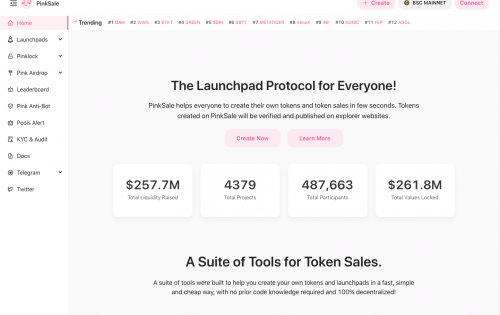
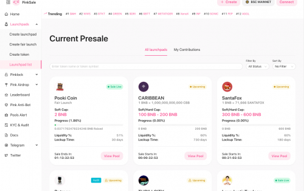

PinkSale 是一个去中心化的启动板，允许用户启动自己的代币并创建自己的初始代币销售。无需任何编码知识，只需导航到我们的终端并单击几下即可设计您自己的代币。PinkSale 提供多种其他功能来帮助您启动整体代币，例如：在 PancakeSwap、UniSwap、ShibaSwap、SushiSwap、KuSwap、QuickSwap 和 MM Finance 上自动列出您的代币，同时让您能够锁定您的 LP 和和为您的代币添加可选的归属期。

除了成为一流的代币销售创建者之外，PinkSale 旨在激励用户继续使用我们的平台。我们的目标是为所有使用我们 Pink 生态系统的投资者提供一个安全的环境。考虑到这一点，我们实施了严格的 KYC 程序，以阻止危险和欺骗行为进入我们的平台。归根结底，对我们来说最重要的是，作为投资者的您感到受到保护，并且可以确信 PinkSale 是您投资加密项目的安全场所。

