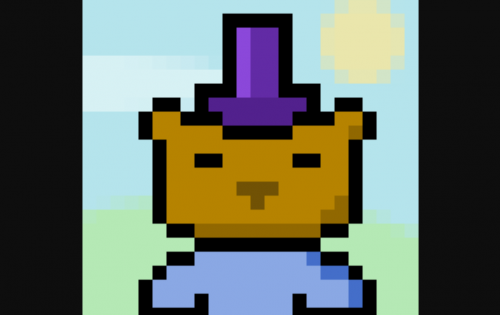

---
title: "PixelBeasts (Beastopia)"
description: "你通往野兽国的钥匙。与 VC、创始人、Devs 设计师等的代币门控游戏、聊天和每周 BeastUps"
date: 2022-08-23T00:00:00+08:00
lastmod: 2022-08-23T00:00:00+08:00
draft: false
authors: ["seven"]
featuredImage: "pixelbeasts-beastopia.png"
tags: ["Collectibles","PixelBeasts (Beastopia)"]
categories: ["nfts"]
nfts: ["Collectibles"]
blockchain: "ETH"
website: "https://www.pixelbeasts.xyz/"
twitter: "https://twitter.com/pixelbeastsnft"
discord: "https://discord.com/invite/9zsM49n93W"
telegram: ""
github: ""
youtube: "https://www.youtube.com/watch?v=A6H4Fw2MVRU&t=4s"
twitch: ""
facebook: ""
instagram: ""
reddit: ""
medium: ""
steam: ""
gitbook: ""
googleplay: ""
appstore: ""
status: "Live"
weight: 
lightgallery: true
toc: true
pinned: false
recommend: false
recommend1: false
---
PixelBeasts 是 10,000 个独特的 NFT 收藏品，每个 24x24 像素由艺术家和 VC，Yohei Nakajima 制作。所有权提供了对 Beastopia 的访问 - 一种不断发展的社交体验，包括活动、游戏等 - 以及一个由 VC、创始人、开发人员和 NFT 爱好者组成的社区，他们手牵手、无所畏惧、乐观地一起冒险深入这个兔子洞。

ixelBeasts 是一种传统的 10k 销售，被称为盲袋或“战利品”风格。您需要连接您的钱包，并且可以选择铸造 1 到 20 个 PixelBeasts。这意味着您可能会得到一些罕见的东西，但不能确定。然后，您可以选择在售后市场买卖每个 PixelBeast。

