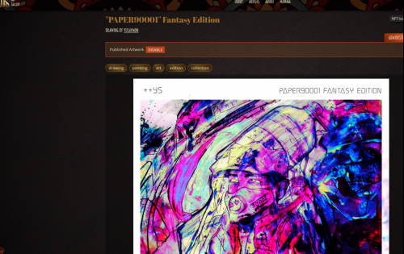
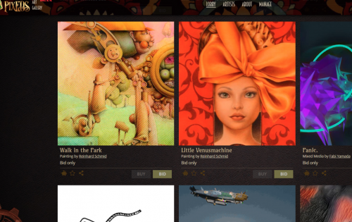

发布艺术，生成您的真实性数字证书（不可替代令牌），以保证您的作品出处并通过您的创作获利。pixEOS Gallery 使用区块链技术让艺术家和收藏家在安全可靠的环境中交易艺术品。我们的本地网络 EOSIO 的快速和免费交易完成了无缝加密艺术体验的包。人工智能和pixEOS Phygital近场通信设备的实施，将实物艺术品与出处的数字证书绑定，将使pixEOS画廊成为最完整的艺术生态系统。立即开始收藏艺术品！

