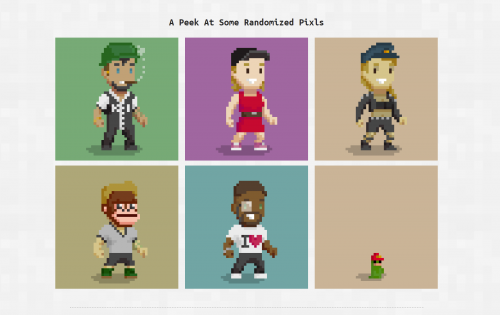

Pixls 是一组 8619 个独特的、有弹性的、可收藏的角色，居住在虚构的 Pixlton 镇。它们是数字艺术和收藏品的结合，每件作品的特定属性决定了它的稀有性。他们都被赋予了一个唯一的身份和通过随机生成算法匹配的怪癖。每个角色都有一个完整的背景故事，包括但不限于独特的名字、生日、恐惧症、过敏症、工作、爱好、友谊以及与其他 Pixls 的浪漫关系。此外，他们还提供了几把手绘的单品供您欣赏。最重要的是，他们已经为它们命名，因此您不必这样做。

出于对像素艺术的热爱，这些角色以过去电子游戏的怀旧风格精心打造。他们是数字世界中一个功能失调的大城镇。

Genesis Pixlton 系列充满了性别和种族多样性，因为在元宇宙中，您也应该为自己的身份感到自豪。围绕您的身份创建您自己的故事，享受自我表达的终极形式。

虽然他们完全享受像素艺术的 2D 特性，但也有许多他们想要支持的 3D 虚拟世界。他们目前正在努力为您准备资产，以便您将 Pixltonian 带入您能想到的任何 3D 世界。通过他们将提供的可下载资源，您可以与 Pixltonians 一起发挥创意。与沙盒等现有元节的集成也在进行中。

