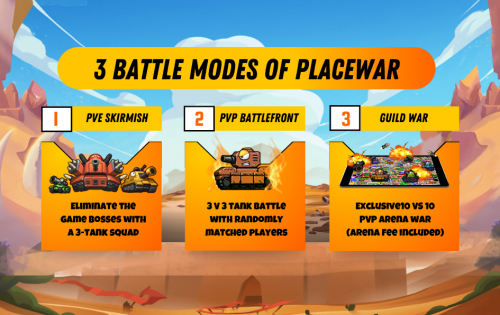
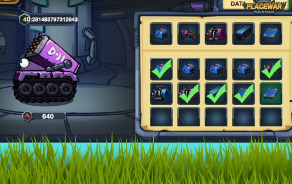
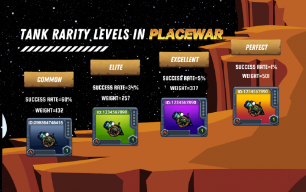

---
title: "PlaceWar"
description: "游戏化互联网文化元界，P2E社交Gamefi战略火炮游戏生态系统。"
date: 2022-08-23T00:00:00+08:00
lastmod: 2022-08-23T00:00:00+08:00
draft: false
authors: ["seven"]
featuredImage: "placewar-1.png"
tags: ["NFT Games","PlaceWar"]
categories: ["nfts"]
nfts: ["NFT Games"]
blockchain: "BSC"
website: "https://placewar.io/"
twitter: "https://twitter.com/placewar_game"
discord: "https://discord.io/placewar"
telegram: "https://t.me/placewar"
github: ""
youtube: "https://www.youtube.com/channel/UCt9FgAfjXdTfkRIrftjkMIA"
twitch: ""
facebook: "https://www.facebook.com/placewargame"
instagram: ""
reddit: "https://www.reddit.com/r/placewargame/"
medium: "https://placewar.medium.com/"
steam: ""
gitbook: ""
googleplay: ""
appstore: ""
status: "Live"
weight: 
lightgallery: true
toc: true
pinned: false
recommend: false
recommend1: false
---
PlaceWar是一个分散的战略性游戏世界，部署在多链上，具有高度引人入胜的火炮游戏玩法，允许玩家通过建设、战斗和联盟来创建和定义游戏世界的前景。

PlaceWar创造了一个游戏化和开放的互联网文化元世界，让用户掌控一切。保证您获得在任何其他 Play-To-Earn 游戏中从未见过的游戏体验。我们将战斗和创造结合起来，并确保有一种激励机制来支持它们。

