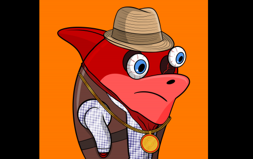
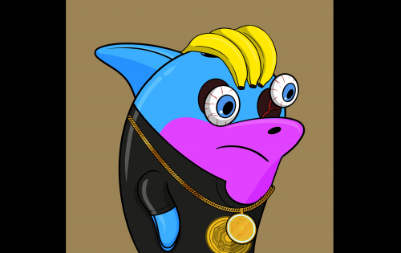

在地球上所有的动物中，鹰可能是最美丽的，蜂鸟是最可爱的，但说到智力，我们选择泰语发音为“Plaloma”的海豚！我们选择海豚作为我们 NFT 集合的主角，因为它具有显着的智慧、同情心以及对娱乐和娱乐他人的渴望。也因为海豚是代表芭东海滩和普吉岛的哺乳动物！在经历了与 Covid-19 大流行一样具有破坏性的时期之后，普吉岛需要在心理和经济上恢复，普吉岛假日硬币团队已经开始了一场非常艰巨的冒险，为这一切提供氧气。普吉假日币团队创建了一个 DeFi phc.finance 平台，一个 PHC 代币，它将尝试无数的用途，并在我们收集的 NFT 的帮助下，正是 PLALOMA（泰语中的海豚）来帮助我们振作起来！TEAM 由具有各种资质、培训和业务经验的人员组成，我们将全力以赴使这个项目取得成功。

