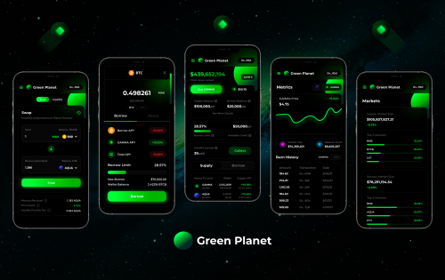
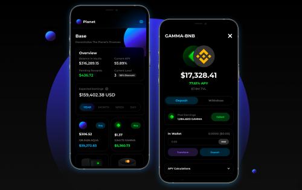
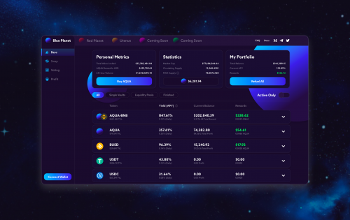

Planet是一个去中心化的金融协议，由不同的行星组成，每个行星都有自己的应用程序，旨在使任何人都可以自由激活他们的资本。Planet 可以访问开放、去中心化的金融服务。 

Planet 社区正在无休止地寻找该领域最好的 DeFi 机会。Planet 要么聚合最好的机会，要么创造它。

AQUA是一种独特的稀缺加密货币，旨在获取价值并管理行星。

GAMMA是一种实用代币，将为 Planet Finance 提供永恒的动力。

AQUA 位于 Planet Finance 的中心并管理着行星。

随着每一秒过去，人们交换代币、在金库中赚钱、借出、借入、转换、购买/出售 NFT；协议从访问这些去中心化“服务”所收取的费用中获取价值。这些“服务”将继续扩展，以指数方式增加由协议捕获并通过 AQUA 驱动的创造价值流。

每过一秒，AQUA 就变得越来越稀缺。

