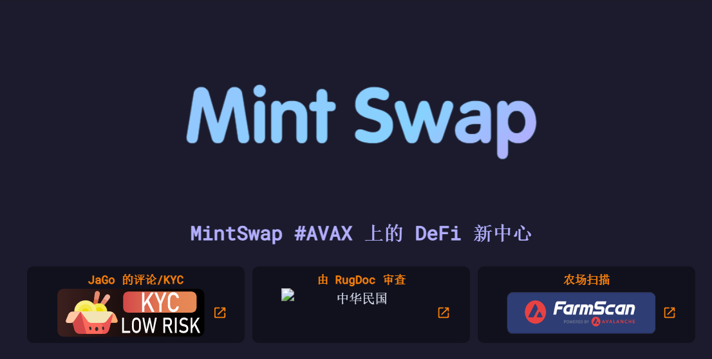

MintSwap，Avax 网络上新的稳定 DeFi 代币，帮助投资者保护他们的资金，因为我们提供透明的环境，让用户可以无忧地使用我们的服务，并有助于通过 Staking 带来稳定的被动收入！我们的主要重点是提供一个安全、稳定的农场和一个强大而活跃的社区！

随着他们的网站上线，初始流动性将作为隐形启动添加。

最大供应量：11,000

低排放率 (0.0095)

初始流动性将被烧毁

未来股息

进入池的百分比低 (2.5%)

