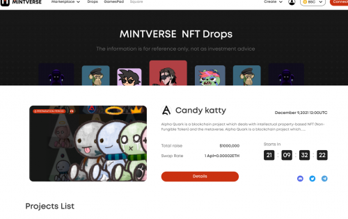
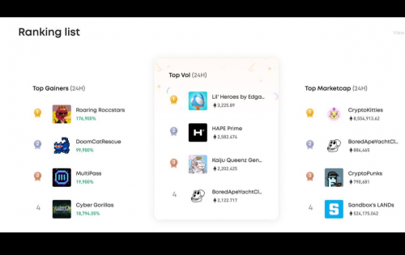
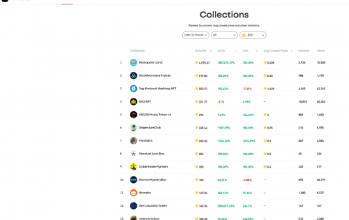

Mintverse 是一个综合性的 NFT 聚合器和市场，用户可以在其中轻松创建、发现和收集一系列数字收藏品、游戏 NFT 等。

最初，它支持 BSC 和 ETH，最终将扩展到其他二层解决方案。它提供的一些核心功能包括 Marketplace（点对点公开市场）、Swap（NFT 交换）、Drops（初始 NFT 产品）、GamesPad（游戏项目聚合器和分销商）、Square（去中心化社交网络和 DID 展示空间）、DAO 等。为了授予治理权并奖励早期贡献者，Mintverse 将很快发行其原生代币（$MINTS）。

Mintverse 是一个 NFT 聚合器和市场，用户可以在其中创建、发现和收集一系列数字项目和 NFT，同时还可以众筹 NFT 项目。

