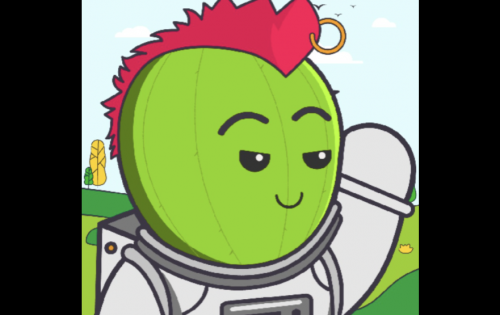
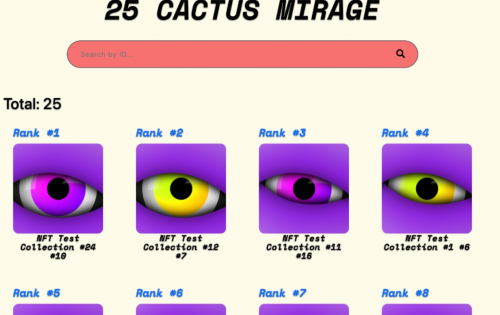

Mirage 试图在 Oasis 内建立一个多样化的生态系统

Mirage 代币是 Mirage 生态系统的门户。Mirage 计划在 Oasis 生态系统的所有领域构建、创造、扩展产品并蓬勃发展。生态系统的中心是实用代币 Mirage 代币，它是导航和使用生态系统所必需的。Cactus Gensis NFT Collection、付费使用 Rarity 工具用于 Oasis 上的 NFT、NFT 市场都是利用 mirage 的项目。

