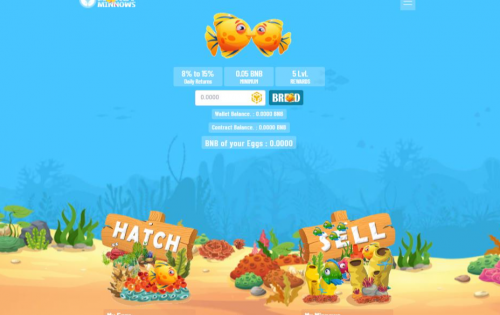
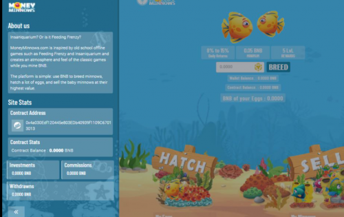
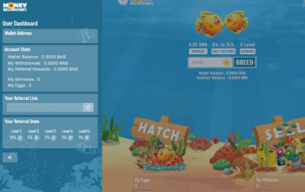

MoneyMinnows.com 是币安智能链网络中首个此类 Dapp（去中心化应用程序）。受老派离线游戏（如 Feeding Frenzy 和 Insaniquarium）的启发，它在您挖掘 BNB 时营造出一种游戏氛围和感觉。

平台很简单：用BNB养殖鲦鱼，孵化出大量的蛋，以最高数量出售小鲦鱼宝宝。

除此之外，Money Minnows 通过将销售限制为每天一次，解决了市场上众多豆叉的困境，实际上提供了一个可持续的长期农场收益平台。

