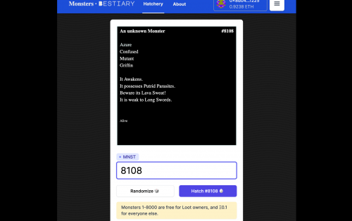
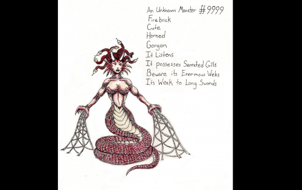
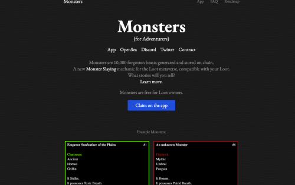

Monsters (for Adventurers) 是由 DnD 和矮人要塞启发的 10,000 个独特怪物的集合。每个怪物都有一组随机的特征，包括颜色、种族、危险、弱点等等。 

Monsters 项目体现了 Loot 的理念，即在社区手中免费为故事、体验、游戏等创建未经过滤、不可审查的构建块。Monsters 为战利品所有者提供了一个新的机制：Monster Slaying。

Monsters (for Adventurers) 的核心是一款用于 Loot 社区的交互式故事构建 NFT 游戏。你的互动以及怪物和战利品之间的关系讲述了一个故事：你的战利品会在各个领域出名吗？还是仅仅是装饰，没有冒险和战斗？你会讲什么故事？

