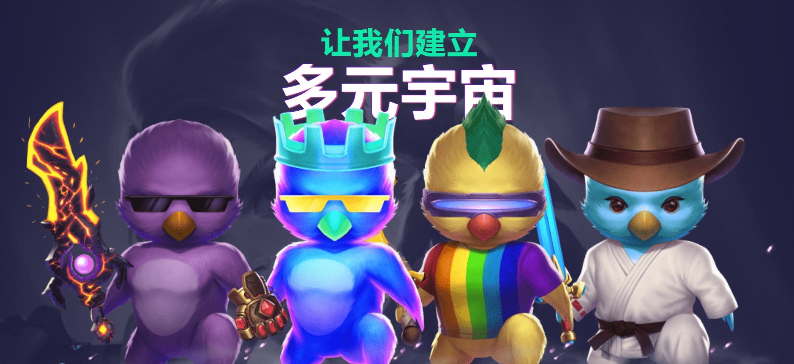

Moonsama 是第一个生成的 NFT 集合，也是第一个建立在 Moonriver 网络上的 NFT 市场。Moonsama 集合由 1,000 个独特的 NFT 组成，为所有者提供对各种 Metaverse 环境的访问。

Moonsama 建立了一个协议，可以实现链上数字资产和链下应用的双向桥接，有效消除这两个世界之间的障碍。

该协议与第一个集成 Moonsama Minecraft Metaverse 紧密结合在一起开发。随着我们对 Metaverses 进行试验并进行新的集成，该协议已经并将继续扩展以包含新功能和新环境，例如 Exosama、Pondsama 和 Raresama。

