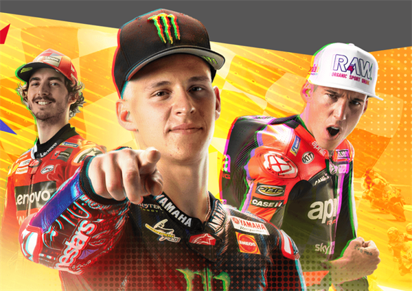

---
title: "MotoGP™ Ignition"
description: "MotoGP 是第二个 REVV 项目，利用 NFT 赋予玩家权力。扮演团队经理的角色，在这个管理游戏中与他人正面交锋！在这里，您可以最大化您的资产收藏和您的战略赛车知识。"
date: 2022-08-18T14:57:40+08:00
lastmod: 2022-08-18T14:57:40+08:00
draft: false
authors: ["Simon"]
featuredImage: "motogp-ignition.png"
tags: ["NFT Games","MotoGP™ Ignition"]
categories: ["nfts"]
nfts: ["NFT Games"]
blockchain: "Flow"
website: "https://motogp-ignition.com/"
twitter: "https://twitter.com/MotoGPIgnition"
discord: "https://discord.com/invite/hmSpr2W8GB"
telegram: ""
github: ""
youtube: ""
twitch: ""
facebook: "https://www.facebook.com/MotoGPIgnition"
instagram: ""
reddit: ""
medium: ""
steam: ""
gitbook: ""
googleplay: ""
appstore: ""
status: "Live"
weight: 
lightgallery: true
toc: true
pinned: false
recommend: false
recommend1: false
---
MotoGP 是第二个 REVV 项目，利用 NFT 赋予玩家权力。扮演团队经理的角色，在这个管理游戏中与他人正面交锋！在这里，您可以最大化您的资产收藏和您的战略赛车知识。

MotoGP™ Ignition 中的所有关键游戏资产都是可拥有的。作为区块链代币，不可替代或可替代的、自行车、骑手、零件等都归玩家所有。它们是可销售的、可交易的和存储价值的。

拿走您的资产并争夺真正的奖品。作为 REVV Motorsport 生态系统的一部分，MotoGP™ Ignition 玩家可以在锦标赛和活动中挑战 REVV 奖品。

