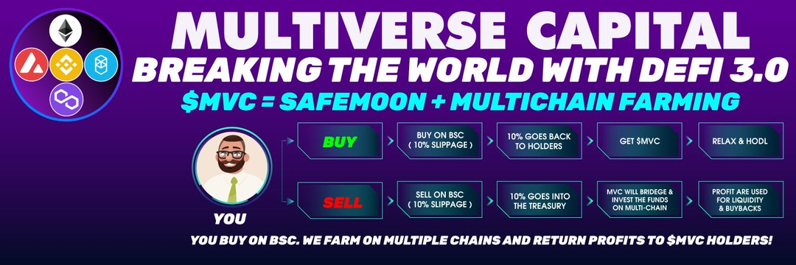

MVC 代币选择将其农业和回购功能与加密市场中一些最大的区块链和多链绑定，包括 Avalanche、Fantom、Polygon 等。这在潜在投资者和早期持有者的心中建立了一定程度的兴趣，他们希望在一个基本面强大的项目中投资并持有他们的收益。一旦用户成为 MVC 持有者，他们可能会倾向于长期持有代币以获得持续的奖励。

它的历史最高点目前为 0.00006531 美元，其历史最低点为 0.00001557 美元，仅在三天前达到。MVC 已触及历史低点，似乎准备在其积累期后飙升并测试其 ATH。

