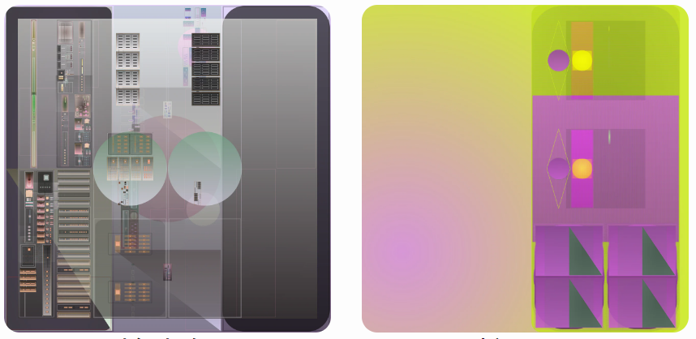

Mutant Garden Seeder 由艺术家 Harm van den Dorpel 于 2021 年与 Folia 合作发布的 512+1 个可生成的独特以太坊 NFT 组成。

每个区块号只能铸造一个突变体。这个选择的出生区块的交易哈希被用作确定性随机函数的种子，用于填充笛卡尔遗传网络（“染色体”）并用作图灵完备机，执行以生成视觉艺术品（“表型”） : 用户选择的种子块 → 块哈希 → 属性 + 种子数 → 确定性随机函数 →笛卡尔遗传网络 + 窗口尺寸 → SVG → 艺术品哈希。