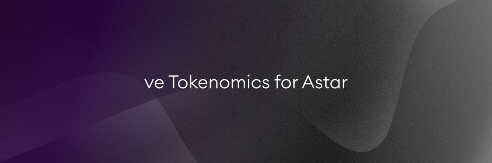

Muuu Finance 提供最简单的方法来最大化您的奖励，而无需锁定 DEX 和 Lending 协议的原生资产。 Muuu Finance 是 Astar Network 上的第一个原生收益助推器，可让您在不锁定 KGL 的情况下最大化您的资产。转换并质押您的 KGL（Kagla Finance 的治理代币），以赚取更多 KGL 和 Muuu Finance 的原生资产作为奖励。

将您的 LP 代币质押给 Muuu Finance 作为一个实体，以有效提高您的奖励，从而获得比您通常质押更多的收入。承诺质押或锁定 MUUU 可以让您获得更多资产。该协议为您提供 muKGL 的奖励。