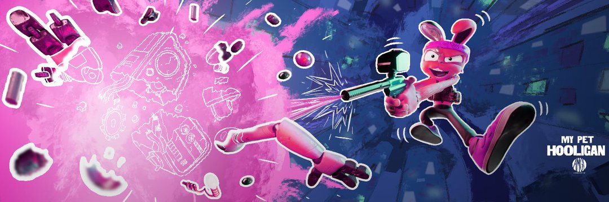

---
title: "My Pet Hooligan"
description: "来自 AMGI Studios 的交互式 NFT 体验。888 个宠物流氓的 NFT 集合——独特的 3D 角色在以太坊区块链上构建，具有各种独特的特征。"
date: 2022-08-22T14:57:40+08:00
lastmod: 2022-08-22T14:57:40+08:00
draft: false
authors: ["Simon"]
featuredImage: "my-pet-hooligan.png"
tags: ["Collectibles","My Pet Hooligan"]
categories: ["nfts"]
nfts: ["Collectibles"]
blockchain: "ETH"
website: "https://mypethooligan.com/"
twitter: "https://twitter.com/mypethooligan"
discord: "https://discord.com/invite/mypethooligan"
telegram: ""
github: ""
youtube: ""
twitch: ""
facebook: ""
instagram: "https://www.instagram.com/mypethooligan/"
reddit: ""
medium: ""
steam: ""
gitbook: ""
googleplay: ""
appstore: ""
status: "Live"
weight: 
lightgallery: true
toc: true
pinned: false
recommend: false
recommend1: false
---
来自 AMGI Studios 的交互式 NFT 体验。888 个宠物流氓的 NFT 集合——独特的 3D 角色在以太坊区块链上构建，具有各种独特的特征。您的 NFT 不仅具有实用性，还将在我们不断扩展的 Metaverse 中充当您独特的可玩角色，The Rabbit Hole 将于 2022 年第一季度发布 Beta 版。

