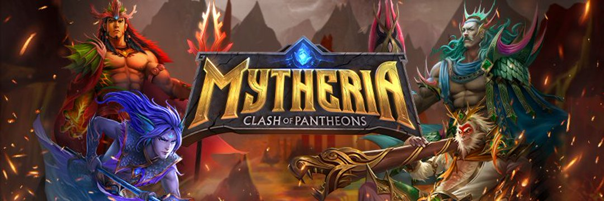

---
title: "Mytheria"
description: "Mytheria 是一个来自不同文化的神为荣誉和荣耀而战的世界，它是第一款结合了玩赚钱和创造赚钱功能的 NFT 纸牌游戏。用户可以免费开始游戏，因为所有新玩家都会收到包含 40 张个人卡片的入门套牌。"
date: 2022-08-19T14:57:40+08:00
lastmod: 2022-08-19T14:57:40+08:00
draft: false
authors: ["Simon"]
featuredImage: "mytheria.png"
tags: ["NFT Games","Mytheria"]
categories: ["nfts"]
nfts: ["NFT Games"]
blockchain: "BSC"
website: "https://mytheria.io/"
twitter: "https://twitter.com/mytheria_MYRA"
discord: ""
telegram: ""
github: ""
youtube: ""
twitch: ""
facebook: ""
instagram: ""
reddit: ""
medium: ""
steam: ""
gitbook: ""
googleplay: ""
appstore: ""
status: "Live"
weight: 
lightgallery: true
toc: true
pinned: false
recommend: false
recommend1: false
---
Mytheria 是一个来自不同文化的神为荣誉和荣耀而战的世界，它是第一款结合了玩赚钱和创造赚钱功能的 NFT 纸牌游戏。用户可以免费开始游戏，因为所有新玩家都会收到包含 40 张个人卡片的入门套牌。战斗竞技场有两条车道，结构类似于 MOBA。玩家的任务是保卫他们的塔并攻击敌人的塔。Mytheria 游戏包含一系列回合和五个阶段，一直持续到取得胜利。游戏以技能为基础，由游戏中的决策以及游戏前的战术构筑组合决定。

