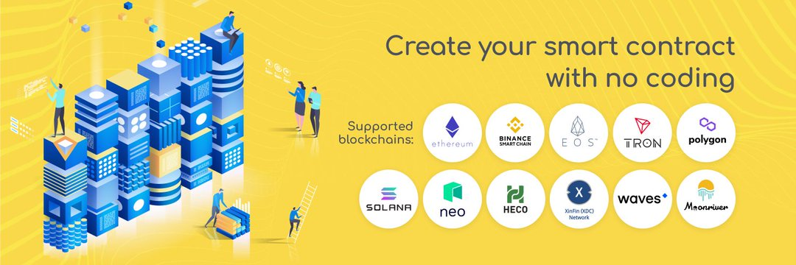

---
title: "MyWish"
description: "MyWish - The First Platform for creating smart contracts with zero codings."
date: 2022-08-19T14:57:40+08:00
lastmod: 2022-08-19T14:57:40+08:00
draft: false
authors: ["Simon"]
featuredImage: "mywish.png"
tags: ["Other","MyWish"]
categories: ["nfts"]
nfts: ["Other"]
blockchain: "Polygon"
website: "https://mywish.io/"
twitter: "https://twitter.com/mywishplatform"
discord: ""
telegram: "https://t.me/MyWish_platform"
github: ""
youtube: ""
twitch: ""
facebook: "https://www.facebook.com/MyWish.io/"
instagram: ""
reddit: ""
medium: ""
steam: ""
gitbook: ""
googleplay: ""
appstore: ""
status: "Live"
weight: 
lightgallery: true
toc: true
pinned: false
recommend: false
recommend1: false
---
无代码区块链解决方案，无需编码即可创建智能合约，以最简单的方式创建自己的代币、智能合约、跨链桥和空投，无需在 MyWish 上具备任何编码技能。

主要成就：

● MyWish.io - 智能合约平台。智能合约生成的领导者。ETH、NEO、EOS、TRON、RSK、Binance Smart Chain、Matic 的构建器

● 创建和部署超过 12,000 个智能合约

● 200 多个项目使用 MyWish 创建代币/ICO

● 波场加速器WINNERS

● WAVES 区块链赠款 WINNERS

● 币安合伙人

● NEO 基金会合作伙伴：neo 区块链改进

● 圣彼得堡国立大学区块链课程