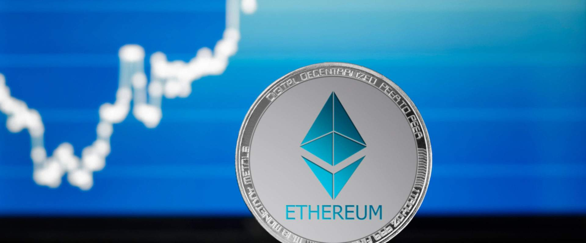

关于 Marketplace Bet 账户名的两个基本操作：如果您猜到该账户名被低估了，将被索取更高的价格——它会为您带来高达 50% 的利润 。索赔：如果您想自己获取该账户名并且在接下来的 72 小时内没有人会为您出价过高

NEAR Accounts Marketplace 是为谁建立的？

创始人寻找出色的账户名并将其投放市场以获得奖励，信徒参与寻找公平的价格，为您的忠实评价和智慧赚取收益 索赔者获得完美的账户名，供内部使用、个人收藏或进一步转售。

