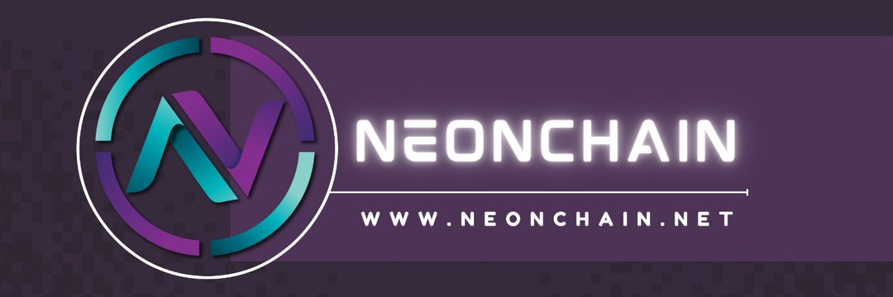

---
title: "NeonChain"
description: "NeonChain is a financial protocol that incorporates multi-strategy yield optimizing on Binance Smart Chain (BSC) with low fees/slippage."
date: 2022-08-19T14:57:40+08:00
lastmod: 2022-08-19T14:57:40+08:00
draft: false
authors: ["Simon"]
featuredImage: "neonchain.png"
tags: ["High risk","NeonChain"]
categories: ["nfts"]
nfts: ["High risk"]
blockchain: "BSC"
website: "https://www.neonchain.net/"
twitter: "https://twitter.com/ChainNeon"
discord: ""
telegram: "https://t.me/NeonChain"
github: "https://github.com/NeonChain"
youtube: "https://www.youtube.com/channel/UC77-chhK4vcvxgBsl56Sonw"
twitch: ""
facebook: ""
instagram: ""
reddit: "https://www.reddit.com/user/NeonChainOFC"
medium: "https://medium.com/@neonchainofc"
steam: ""
gitbook: ""
googleplay: ""
appstore: ""
status: "Live"
weight: 
lightgallery: true
toc: true
pinned: false
recommend: false
recommend1: false
---
NeonChain 是一种金融协议，在币安智能链 (BSC) 上结合了多策略收益优化，具有低费用/滑点。通过持有 NNC 代币，您每次在平台上发生交易时都可以获得 BNB 和 NNC 奖励。  

✅ 核心团队全员 

✅ 审核中（Solidproof） 

✅ 智能合约代码验证

