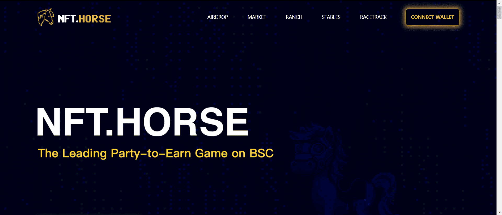

这是一款基于以太坊网络的 GameFi 赛马游戏。我们相信，在不久的将来，传统的线下商业模式和互联网商业模式将会以去中心化、分布式、无人值守的方式运行。通过智能合约，全球任何玩家都可以在可靠的合约保障模式下进行合作、互动和交易。

Nft.Horse是一款集游戏、金融、线下赛马行业等领域为一体的APP。玩家可以在世界各地匿名尝试游戏。任何玩家都是赛马游戏生态的建设者和参与者。拥有代币意味着拥有参与游戏的权利。游戏分为：驯马、繁殖、交易、赛马（创造、参与、猜谜）、养成等玩法，可无限拓展。游戏经济系统具有高度的流动性和稀缺性。

